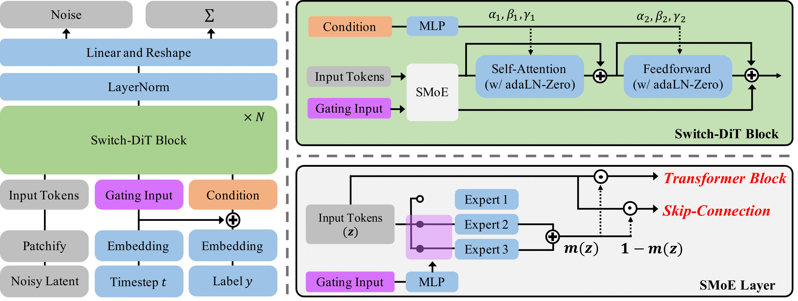

# Switch Diffusion Transformer: Synergizing Denoising Tasks with Sparse Mixture-of-Experts

<!-- Arxiv Link, Project Link -->

<a href="https://arxiv.org/abs/2403.09176"></a>
<a href="https://byeongjun-park.github.io/Switch-DiT/"></a>

This repository contains the official pytorch implementation of the paper: "Switch Diffusion Transformer: Synergizing Denoising Tasks with Sparse Mixture-of-Experts".
In this repository, we release codes for the improved version of [DiT](https://openaccess.thecvf.com/content/ICCV2023/papers/Peebles_Scalable_Diffusion_Models_with_Transformers_ICCV_2023_paper.pdf) and [DTR](https://openreview.net/pdf?id=MY0qlcFcUg) with the sparse mixture-of-experts. 



This project is inspired by following our previous work: 
- [ANT](https://github.com/gohyojun15/ANT_diffusion/blob/main/README.md): Addressing Negative Transfer in Diffusion Models (Neurips 2023)
- [DTR](https://github.com/byeongjun-park/DTR): Denoising Task Routing for Diffusion Models (ICLR 2024)
----------------


## Updates

 * **2024.03.14**: Initial Release.


## Setup
<a href="https://pytorch.org/get-started/locally/"></a>
<a href="https://hydra.cc/"></a>

We use 8 80GB A100 GPUs for all experiments. 
```
python3 -m pip install -r requirements.txt
cd models/parallel_linear
python3 -m pip install .
cd ../..
```

## Training Switch-DiT

We provide an example training script for ImageNet.
 
```
torchrun --nnodes=1 --nproc_per_node=8 train.py general.data_path='<PATH_TO_DATASET>'
```

You can also modify the Switch-DiT model, optimization type, etc.

```
torchrun --nnodes=1 --nproc_per_node=8 train.py \
general.data_path='<PATH_TO_DATASET>' \
general.loss_weight_type="uw" \
models.name="DiT-L/2" \
```

## Sampling Switch-DiT
After training, the checkpoint and log files are saved based on the configuration.
Consequently, you need to execute the sampling script using the same configuration as the training script. 
Additionally, you can adjust the number of sampling images and the classifier-guidance scale.

```
torchrun --nnodes=1 --nproc_per_node=8 sample_ddp.py \
general.loss_weight_type="uw \
models.name="DiT-L/2" \
eval.cfg_scale=1.5 \
eval.num_fid_samples=50000
```

Please refer to the [example scripts](https://github.com/byeongjun-park/Switch-DiT/tree/main/example_script.sh) for detailed instructions how to reproduce our results.
In this script, we enumerate the configurations that can be modified if needed.

## Results

Our Switch-DiT achieves consistent performance improvements on the ImageNet dataset.


**Quantitative Results (guidance scale = 1.5)**

| Model         |  FID-50K   | Inception Score |  Precision  |  Recall   |
|:--------------|:----------:|:---------------:|:-----------:|-----------|
| DiT-S         |   44.28    |      32.31      |    0.41     |   0.53    |
| DTR-S         |   37.43    |      38.97      |    0.47     | **0.54**  |
| Switch-DiT-S  | **33.99**  |    **42.99**    |  **0.52**   | **0.54**  |
| DiT-B         |   27.96    |      64.72      |    0.57     |   0.52    |
| DTR-B         |   16.58    |      87.94      |    0.66     | **0.53**  |
| Switch-DiT-B  | **16.21**  |    **88.14**    |  **0.68**   | **0.53**  |
| DiT-L         |   12.59    |     134.60      |    0.73     |   0.49    |
| DTR-L         |    8.90    |     156.48      |    0.77     | **0.51**  |
| Switch-DiT-L  |  **8.78**  |   **162.97**    |  **0.78**   |   0.50    |
| DiT-XL        |    9.40    |     166.83      |    0.77     | **0.48**  |
| DTR-XL        |   10.85    |     158.45      |    0.73     |   0.47    |
| Switch-DiT-XL |  **8.76**  |   **169.17**    |  **0.79**   | **0.48**  |


## BibTeX


```bibtex
@article{park2024switch,
  title={Switch Diffusion Transformer: Synergizing Denoising Tasks with Sparse Mixture-of-Experts},
  author={Park, Byeongjun and Go, Hyojun and Kim, Jin-Young and Woo, Sangmin and Ham, Seokil and Kim, Changick},
  journal={arXiv preprint arXiv:2403.09176},
  year={2024}
}
```

## Acknowledgments
This codebase borrows from most notably [DIT](https://github.com/facebookresearch/DiT) and [DTR](https://github.com/byeongjun-park/DTR).
